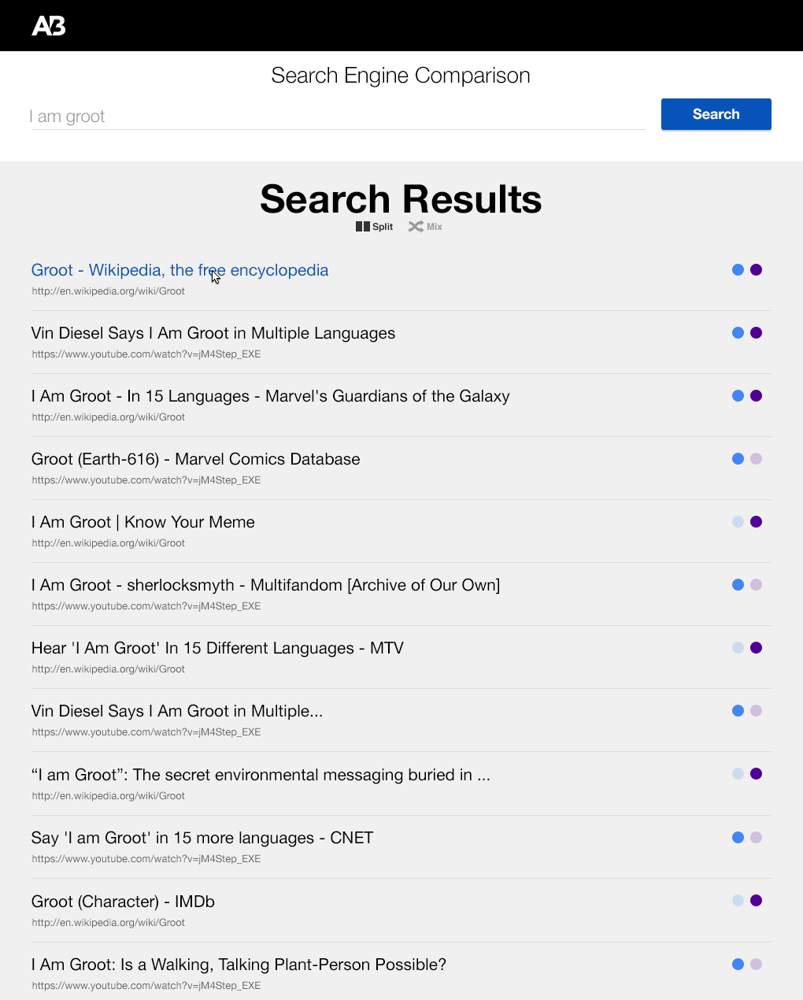
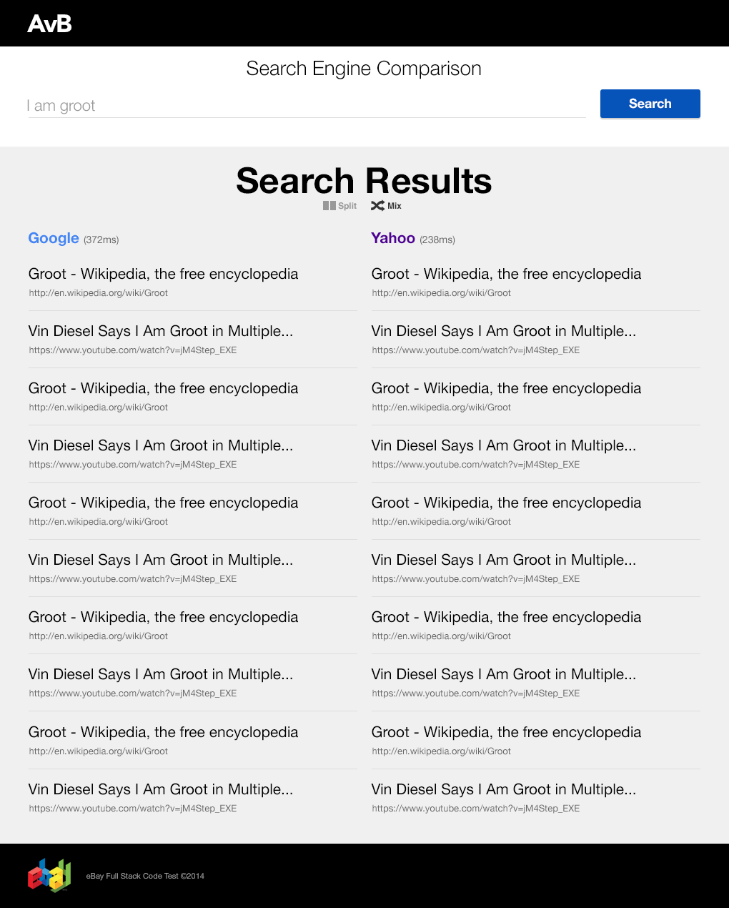

Code Test
=========

The goal of the code test is to build a search engine comparator. It involves both frontend and backend skills.
- [Code Test](#code-test)
  - [Getting Started](#getting-started)
  - [User Story](#user-story)
  - [Backend Requirements](#backend-requirements)
    - [Definition of done](#definition-of-done)
  - [FrontEnd Requirements](#frontend-requirements)
    - [Definition of done](#definition-of-done-1)
  - [User Interface](#user-interface)
    - [Sprites](#sprites)
    - [Unified Mockup](#unified-mockup)
    - [Split Mockup](#split-mockup)

## Getting Started
- Start a docker container using the docker [image](service_image.tar.gz) provided
- Once the container is up and running you should be able to access the following endpoints which will be use in later section by your backend to get data from. Service will be running on port `4500`.
  - GET /bing
  - GET /yahoo
  - GET /google
- Implement a Full-Stack application (Frontend and Backend) using stack of your choice (really anything you like!!)

## User Story
As a user, I would like, from a search query, to get results from different search engines in order to be able to compare the quality of results

### Definition of done
1. The results should be blended/ordered using a relevance criteria of your choice.
2. The UI should look like the design of the mockups:  [Unified](#unified-mockup) and [Split](#split-mockup)
3. The requests to the the endpoints i.e. `/bing`, `/google`, and `/yahoo` should be done in parallel

## User Interface
### Sprites
To make the UI work easier, we made you available 2 sets of sprites

1. [Buttons](resources/PNG/codeTestStyles.png)
2. [General UI Elements](resources/PNG/codeTestSprite.png)

### Unified Mockup

### Split Mockup

